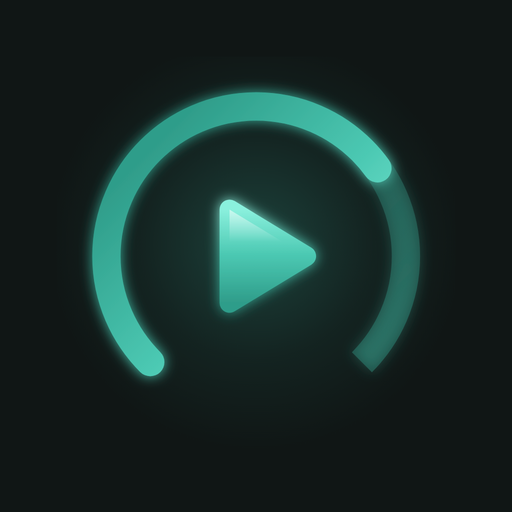
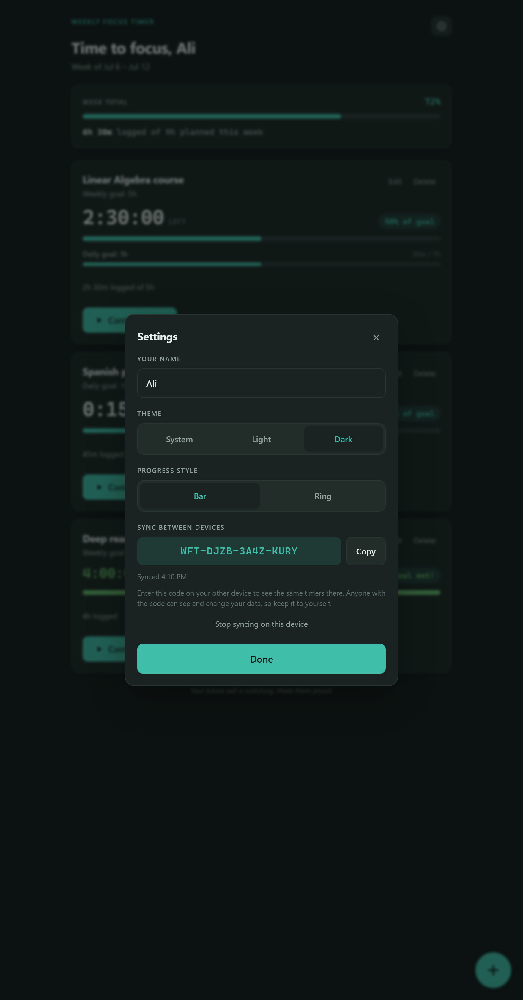

# Weekly Focus Tracker

A single-file web app for tracking time spent on the objectives you care about, measured against weekly (or daily) goals.

## Preview

| Dark · bar progress | Light · ring progress | Settings · cross-device sync |
| :---: | :---: | :---: |
|  |  |  |

Toggle between the two progress styles and light/dark themes from Settings, and pair devices with a sync code.

## Features

- **Weekly or daily goals** — each objective targets a weekly total, or set it to **daily** (it gets a `Daily` tag and resets at midnight). A weekly objective can also carry an optional **daily sub-goal** shown as a second bar.
- **Per-task timer** — press **Begin task** to start tracking, **Pause** to stop. Only one timer runs at a time, so time is never double-counted. Timers are timestamp-based, so they keep counting correctly across refreshes and closed tabs.
- **Manual logging** — forgot to start the timer? Use **+ Log time** to add (or subtract) hours and minutes by hand.
- **Live progress** — each objective shows a countdown, percentage of goal, and a bar/ring that turns green at 100%. Keep going past the goal and it flips to a green count-up timer with a **Goal met!** badge.
- **Weekly summary** — combined time logged vs. planned across your weekly objectives (time past any one goal doesn't inflate the total).
- **Rewarding completions** — a congratulations popup when you finish an objective or your whole week; daily goals glow when hit.
- **Cross-device sync, no account** — create a sync code on one device and enter it on another; both show the same timers (even a running one). The code is the only key to your data, so treat it like a password.
- **Automatic resets** — weekly goals zero out every Monday, daily goals every midnight; your goals themselves stay.
- **First-run setup** — asks your name and walks you through creating your first objective, then greets you by name.
- **Settings** — change your name, theme (system / light / dark), progress style (bar or ring), and sync from the gear menu.
- **Local & private** — all data is stored in your browser via `localStorage`. Nothing leaves your device unless you turn on sync.
- **Installable** — works as a full-screen home-screen app on iOS/Android (PWA), and every [release](https://github.com/Chimpinski/Weekly-Focus-Tracker/releases) ships an unsigned `.ipa` for sideloading.

## Live app

**▶ [chimpinski.github.io/Weekly-Focus-Tracker](https://chimpinski.github.io/Weekly-Focus-Tracker/)**

Open it in any modern browser — no build step, no dependencies. You can also just open `index.html` from disk.

See [CHANGELOG.md](CHANGELOG.md) for what's new in each version.

## Install on your iPhone (or Android)

Two ways to get it on your phone:

**Option A — Add to Home Screen (PWA, easiest).** It's an installable Progressive Web App, so you can run it like a native app without the App Store:

1. Open the [live app](https://chimpinski.github.io/Weekly-Focus-Tracker/) in **Safari** on your iPhone.
2. Tap the **Share** button, then **Add to Home Screen**.
3. Launch it from your home screen — it runs full-screen with its own icon and works offline.

**Option B — Sideload the `.ipa` (native app).** Every [release](https://github.com/Chimpinski/Weekly-Focus-Tracker/releases/latest) attaches an **unsigned `.ipa`** (`WeeklyFocusTimer-unsigned.ipa`). Download it and install with a sideloading tool such as **AltStore**, **Sideloadly**, or a signing service — they sign it with your own Apple ID at install time. Bundle ID `com.chimpinski.weeklyfocus`, min iOS 13.

Either way your logged time is stored on the device — use the same install (or turn on sync) to keep your history. The PWA and the sideloaded app are separate installs with separate storage, so pick one as your main, or link them with a sync code.
