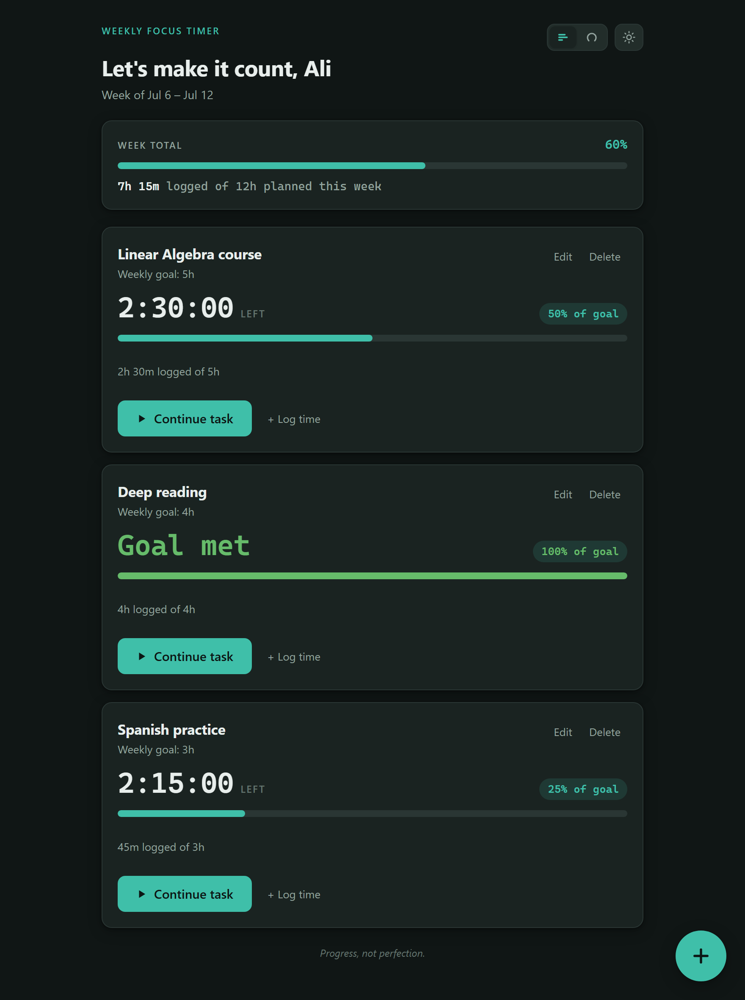
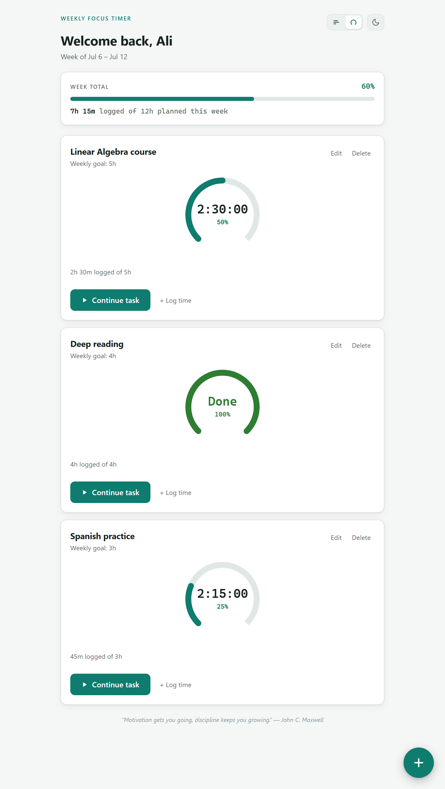

# Weekly Focus Tracker

A single-file web app for tracking time spent on the objectives you care about, measured against weekly goals.

## Preview

| Dark theme · bar progress | Light theme · ring progress |
| :---: | :---: |
|  |  |

Toggle between the two progress styles and light/dark themes right from the header.

## Features

- **Objectives with weekly goals** — give each objective a name and a target time for the week (e.g. "Linear Algebra course, 5 hours").
- **Per-task timer** — press **Begin task** to start tracking, **Pause** to stop. Only one timer runs at a time, so time is never double-counted. Timers are timestamp-based, so they keep counting correctly across refreshes and closed tabs.
- **Manual logging** — forgot to start the timer? Use **+ Log time** to add (or subtract) hours and minutes by hand.
- **Live progress** — each objective shows a countdown of remaining time, percentage of goal, and a progress bar that turns green when the goal is met.
- **Weekly summary** — a combined view of total time logged vs. planned across all objectives.
- **Automatic weekly reset** — goals stay, logged time zeroes out every Monday.
- **Local & private** — all data is stored in your browser via `localStorage`. Nothing is sent anywhere.
- **Light & dark themes** — follows your system preference.

## Usage

Open `index.html` in any modern browser. That's it — no build step, no dependencies.

To use it online, enable **GitHub Pages** for this repository (Settings → Pages → deploy from the `main` branch), and it will be served at `https://chimpinski.github.io/Weekly-Focus-Tracker/`.
